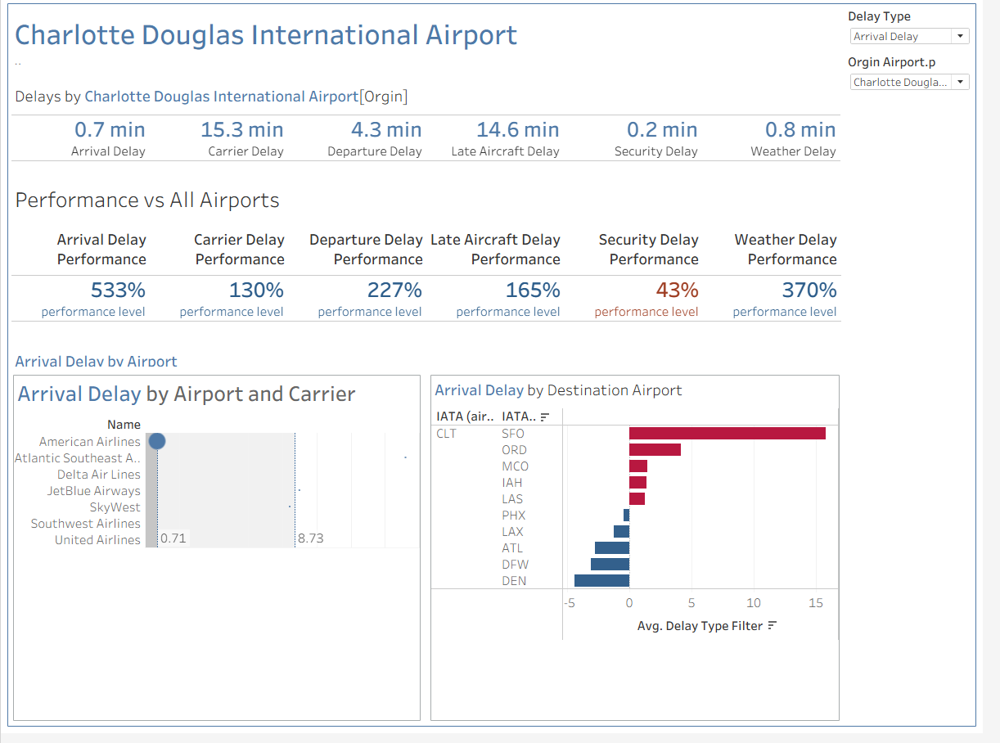

# Airport_Performance_Dashboard
An interactive airport analytics dashboard designed to evaluate and compare operational performance across U.S. airports. The dashboard provides a comprehensive view of delay metrics and benchmarks a selected airport against all other airports in the dataset. The dashboard helps uncover operational inefficiencies and highlights areas impacting overall airport performance.

## Airport Dashboard Preview

This project analyzes airport on-time performance using key delay indicators and presents insights through an intuitive, interactive dashboard. It enables users to:

-Monitor average delay times

-Compare airport performance against national averages

-Identify delay drivers by category

-Explore carrier level and destinationlevel delay patterns

Key Metrics Analyzed:

-Arrival Delay

-Carrier Delay

-Departure Delay

-Late Aircraft Delay

-Security Delay

-Weather Delay

Users can filter by:

-Delay type

-Origin airport

Each metric is:

-Displayed as an average delay time (in minutes)

-Benchmarked against all other airports

-Converted into a performance percentage to quickly assess relative standing

Performance vs All Airports: Shows how a selected airport performs compared to the overall airport population using performance-level percentages.

Delay Breakdown: Displays detailed average delay times across all categories for a selected airport.

Arrival Delay by Carrier: Visual comparison of arrival delays by airline to identify carrier-specific trends.

Arrival Delay by Destination Airport: Breakdown of delays by destination airport (IATA code) to detect route-level patterns.

